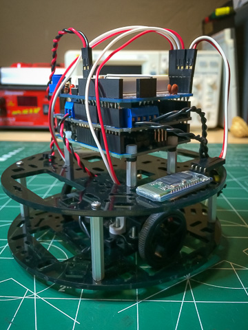

#NavBot Version 1

[Note: Documentation is an ongoing process...There will be gaps]

##Overview
This snapshot is of the initial barebones implmentation of the two key systems: **Navigator** and **Pilot**.

The **Navigator** handles robot localization. The current version only supports odometry based dead reckoning via wheel encoders.

The **Pilot** controls movement of the robot and uses the **Navigator** to obtain realtime position, orientation and movement information to precisely manuever the bot.

In the main code also implements a simplistic waypoint system that is used to test the **Pilot** and **Navigator**. 

##Documentation

Look in the 'docs' subfolder for more detailed information on the subsystems:

  * [**Navigator Docs**](docs/Navigator.md)
  * [**Pilot Docs**](docs/Pilot.md)

##Articles
  * [**Putting NavBot Version 1 on your Robot**](http://solderspot.wordpress.com/2014/05/23/navbot-version-1)  
  * [**Calibrating NavBot**](derspot.wordpress.com/2014/05/23/navbot-calibration)  
  * [**Tuning The PID Controllers**](http://solderspot.wordpress.com/2014/05/22/navbot-tuning-the-pid-controllers)  
  
## BlackBot

